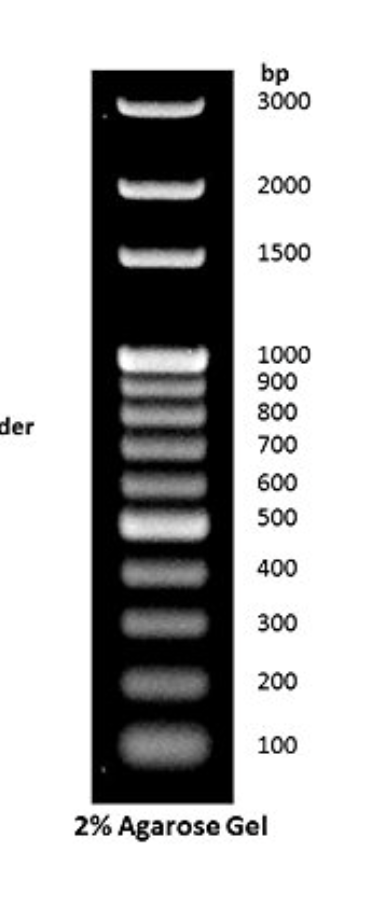
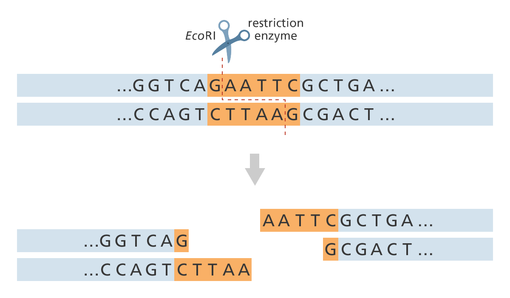

Python 4 Problem Set -- Lists and Loops
===================

1. List manipulation: For the next series of tasks about lists use the **interpreter**:  
	a.  Create a list of 5 of your favorite things.  
	b.  Use the `print()` function to print your list.  
	c.  Use the `print()` function to print out the middle element.  
	d.  Now replace the middle element with a different item, such as your favorite song, or your favorite song bird.  
	e.  Use the same print statement from b to print your new list. Check out the differences.   
	f.  Add a new element to the end. [Read about append()](https://www.tutorialspoint.com/python/list_append.htm).  
	g.  Add a new element to the beginning. [Read about insert()](https://www.tutorialspoint.com/python/list_insert.htm).  
        h.  Add a new element somewhere other than the beginning or the end.  
        i.  Remove an element from the end. [Read about pop()](https://www.tutorialspoint.com/python/list_pop.htm).  
        j.  Remove an element from the beginning.  
        k.  Remove an element from somewhere other than the beginning or the end.  
	l.  Use `join` to create a string. Join the elements on ', '  
	m. **Exit the interpreter**
	
2. List manipulation: Create a new **script using a text editor**   
    a. In the script, create a variable called `taxa_string` that contains this string:  `"sapiens : erectus : neanderthalensis"`  
    b. Print `taxa_string`  
    c. Split `taxa_string` into a list called `taxa_list`. Use `" : "` as your separator.  
    d. Print `taxa_list`.  
    e. Print `taxa_list[1]`, what do you get?  
    f. Print `type(taxa_string)`. What is it's type? Print `type(taxa_list)`. What is it's type?  
    g. Sort the list alphabetically and print (hint: lookup the function `sorted()`).   
    h. Sort the list by length of each string and print. (The shortest string should be first). [Check out documentation of the key argument](https://www.programiz.com/python-programming/methods/built-in/sorted).  

3. Lists and copy: Using the **Python interpreter**, interrogate the difference between these two ways to copy a list. Careful! One of these is NOT what you might expect. 
   a. Method 1
     - Create a list. For example: `my_list = ['a', 'bb', 'ccc']`
     - Make a copy using the `=` assignment operator:  `list_copy = my_list`
     - Print the original list `print(my_list)`
     - Alter the `list_copy` by adding a new element using `append()`
     - Print the original list again `print(my_list)`
   b. Method 2  
     - Create a list. For example: `my_list2 = ['a', 'bb', 'ccc']`  
     - Make a copy with the copy() method `list_copy2 = my_list2.copy()`  
     - Print the original list `print(my_list2)`
     - Alter the `list_copy2` by adding a new element using `append()`   
     - Print the original list again `print(my_list2)`
     - **close the interpreter** 

4. While loops: **Write a script with a text editor**.
   -  Use a `while` loop to print out the numbers 1 to 100.
   -  After you correctly print out each number in the body of the while loop, add in a variable, `sum` that is used to keep a running sum of each number.
   -  Outside the while loop print the total sum of all numbers 1 to 100.
   -  Verify that your sum is correct. The sum of every number between 1 to 100 is 5050.
   

5. While loops: **Write a script**  
   - Use a `while` loop to calculate the [factorial](https://en.wikipedia.org/wiki/Factorial) of 10.
   - Your result should be 3628800

6. For Loops: **Write a script**  
   - Iterate through each element of this list using a `for` loop: `[101,2,15,22,95,33,2,27,72,15,52]`
   - Print only the values that are even (hint: use the modulus operator).

   
7. For Loops: **Add to your previous script**  
     - Sort the elements of the above list
     - Then iterate through each element using a `for` loop. Nested within the loop
       - Print each element.
       - Calculate two cumulative sums, one of all the even values and one of all the odd values.

     - Finally outside the nested `for` block
        - print the final two sums formatted like this:
         ```
         Sum of even numbers: 150
         Sum of odds: 286
         ```
   
8. For Loops and Ranges:  **Create a script**.  
  -  Use `range()` in a `for` loop to print out every number between 0 and 99  
  -  Modify your loop to print out every number between 1 and 100.
      
9. List Comprehension: **Create a script**.    
   -  Create a list using list comprehension with every number between 0 and 99
   -  Create another list with every number between 1 and 100.
   -  Verify your lists have the correct values by printing the contents using a `for` loop
     
10. User input, for loops, and Range: **Create a script**.    
   -  Get the user provided minimum (`sys.argv[1]`) and maximum (`sys.argv[2]`).
   -  Print out every number between and including the min and max to your output.

11. User input, Range, List Comprehension: **Create a script**.    
   -  Get the user provided minimum (`sys.argv[1]`) and maximum (`sys.argv[2]`).
   -  Use list comprehension to create a list of all the numbers between and including the min and max


     
12. User input, Range, List Comprehension, and Conditions: **Create a script**  
    -  Do the same as above to create a new list
    -  Add an `if` so that only odd numbers are added to the list
     
13. Lists, for loops, and strings: **Create a script**, start with writing out your steps as comments.    
   - Create a list with the following data:
      `['ATGCCCGGCCCGGC','GCGTGCTAGCAATACGATAAACCGG', 'ATATATATCGAT','ATGGGCCC']`
   - Use a `for` loop to iterate through each element of this list
   - For each element in the list, print its length and sequence separated by a tab. The output should look like:
   
   ```
   14	ATGCCCGGCCCGGC
   25	GCGTGCTAGCAATACGATAAACCGG
   12	ATATATATCGAT
   8	ATGGGCCC
   ```
   - Next, print out the number (position in the list) of each sequence. Make sure your columns are tab separated (i.e., "index\\tlength\\tsequence\\n")
   ```
   0	14	ATGCCCGGCCCGGC
   1	25	GCGTGCTAGCAATACGATAAACCGG
   2	12	ATATATATCGAT
   3	8	ATGGGCCC
   ```

  - Now, sort your list of DNA fragments by size, longest to shortest, and print them out. Your ouput should represent what you would see after performing electrophoresis on an agarose gel.

	
	
  The output will loook like this

```  
GCGTGCTAGCAATACGATAAACCGG
ATGCCCGGCCCGGC
ATATATATCGAT
ATGGGCCC
```
   
14. Have you been committing you work?

-----------------
-----------------

**Fun challenge problems! These are real scripts you might use in real life. You have already learned all you need to know to do each. If you don't have enough time in this session to complete, come back and try later. Or save for when you get home.**  

-----------------
-----------------

1. Sometimes you may need to show that some element or pattern in your DNA sequence is significant and not present by chance. One way to do this is to create 10s of thousands of shuffled sequences and see how many times you find your pattern.
  
  Write a script that can create one shuffled sequence.  
    - Read about the ([Fisher-Yates shuffle](https://en.wikipedia.org/wiki/Fisher%E2%80%93Yates_shuffle)) 
    - Use a `for` loop to perform the following procedure N times (N = length of seq)
    - Select a random position A with `randrange()`
    - Select a random position B with `randrange()`
    - Exchange the letters at list indices A and B
    - Print the final shuffled sequence
    - Remember to test your code with test data. 

4. How similar are two sequences? To determine this, calculate sequence identity:
    - Start with 2 very similar DNA sequences. Use your favorites or use [Python_04.fasta](https://raw.githubusercontent.com/prog4biol/pfb2025/master/files/Python_04.fasta)
    - Align with [ClustalOmega](https://www.ebi.ac.uk/jdispatcher/msa/clustalo), [TCoffee](https://tcoffee.crg.eu/), [MAFFT](https://mafft.cbrc.jp/alignment/server/index.html), or some other web alignment application. 
    - Output should be in FASTA format.
    - Store (copy and paste) each aligned sequence, including dashes, as two separate string variables. 
    - Get rid of newlines (if any). Newline characters are not part of sequence!
    - Use a `for` loop with `range()` to compare each index for nucleotide differences.
    - Report percent identity of the two sequences.

6. A new Restriction Fragments script:
      
 EcoRI restriction enzyme cutter illustration:  
   
 
   - Find [EcoRI](https://www.neb.com/products/r0101-ecori#Product%20Information) in this DNA sequence:  
    
```
GATGGGATTGGGGTTTTCCCCTCCCATGTGCTCAAGACTGGCGCTAAAAGTTTTGAGCTTCTCAAAAGTCTAGAGCCACCGTCCAGGGAGCAGGTAGCTGCTGGGCTCCGGGGACACTTTGCGTTCGGGCTGGGAGCGTGCTTTCCACGACGGTGACACGCTTCCCTGGATTGGCAGCCAGACTGCCTTCCGGGTCACTGCCATGGAGGAGCCGCAGTCAGATCCTAGCGTCGAGCCCCCTCTGAGTCAGGAAACATTTTCAGACCTATGGAAACTACTTCCTGAAAACAACGTTCTGTCCCCCTTGCCGTCCCAAGCAATGGATGATTTGATGCTGTCCCCGGACGATATTGAACAATGGTTCACTGAAGACCCAGGTCCAGATGAAGCTCCCAGAATTCGCCAGAGGCTGCTCCCCCCGTGGCCCCTGCACCAGCAGCTCCTACACCGGCGGCCCCTGCACCAGCCCCCTCCTGGCCCCTGTCATCTTCTGTCCCTTCCCAGAAAACCTACCAGGGCAGCTACGGTTTCCGTCTGGGCTTCTTGCATTCTGGGACAGCCAAGTCTGTGACTTGCACGTACTCCCCTGCCCTCAACAAGATGTTTTGCCAACTGGCCAAGACCTGCCCTGTGCAGCTGTGGGTTGATTCCACACCCCCGCCCGGCACCCGCGTCCGCGCCATGGCCATCTACAAGCAGTCACAGCACATGACGGAGGTTGTGAGGCGCTGCCCCCACCATGAGCGCTGCTCAGATAGCGATGGTCTGGCCCCTCCTCAGCATCTTATCCGAGTGGAAGGAAATTTGCGTGTGGAGTATTTGGATGACAGAAACACTTTTCGTGGGGTTTTCCCCTCCCATGTGCTCAAGACTGGCGCTAAAAGTTTTGAGCTTCTCAAAAGTCTAGAGCCACCGTCCAGGGAGCAGGTAGCTGCTGGGCTCCGGGGACACTTTGCGTTCGGGCTGGGAGCGTGCTTTCCACGACGGTGACACGCTTCCCTGGATTGGCAGCCAGACTGCCTTCCGGGTCACTGCCATGGAGGAGCCGCAGTCAGATCCTAGCGTCGAGCCCCCTCTGAGTCAGGAAACATTTTCAGACCTATGGAAACTACTTCCTGAAAACAACGTTCTGTCCCCCTTGCCGTCCCAAGCAATGGATGATTTGATGCTGTCCCCGGACGATATTGAACAATGGTTCACTGAAGACCCAGGTCCAGATGAAGCTCCCAGAATTCGCCAGAGGCTGCTCCCCCCGTGGCCCCTGCACCAGCAGCTCCTACACCGGCGGCCCCTGCACCAGCCCCCTCCTGGCCCCTGTCATCTTCTGTCCCTTCCCAGAAAACCTACCAGGGCAGCTACGGTTTCGCTACGTCTGGGCTTCTTGCATTCTGGGACAGCCAAGGTCATCTGTGACTTGCACGTACTCCCCTGCCCTCAACAAGATGTTTTGCCAACTGGCCAAGACCTGCCCTGTGCAGCTGTGGGTTGATTCCACACCCCCGCCCGGCACCCGCGTCCGCGCCATGGCCATCTACAAGCAGTCACAGCACATGACGGAGGTTGTGAGGCGCTGCCCCCACCATGAGCGCTGCTCAGATAGCGATGGTCTGGCCCCTCCTCAGCATCTTATCCGAGTGGAAGGAAATTTGCGTGTGGAGTATTTGGATGAC
```
   - replace the EcoRI site 'GAATTC' with this 'G^AATTC'
   - split the new formatted sequence on the cut sites, store the resulting fragments in a list
   - iterate over each fragment and report
      - the start position in the original sequence
      - the end position in the original sequence
      - the length of each fragemnt
   - sort the fragments by length and print out as they would appear after electrophoresis on a agrose gel. (big to little)
